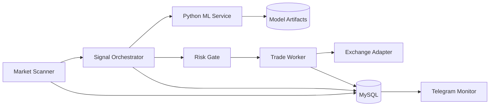

# ML Trading System Architecture

System-level architecture case study for an AI-assisted crypto trading platform. The production system combines a market scanner, signal orchestrator, ML service, risk gate, trade worker, persistence layer, and Telegram monitoring.

This repository exists to show the architecture and engineering ownership behind the system, not to publish a trading strategy.

## 30-Second Overview

The system scans crypto futures markets, builds normalized market snapshots, evaluates candidates with ML-assisted scoring, applies deterministic risk gates, and manages open positions through a separate worker.

The core engineering challenge is not "call an exchange API". It is building a system where discovery, decision-making, risk controls, provider failures, and position management do not block or corrupt each other.

## Impact

- Built an end-to-end AI-assisted trading system with a TypeScript trading engine and Python ML service.
- Separated scanning, orchestration, ML scoring, risk gates, and worker-based position management.
- Designed safety boundaries so new entries can be stopped without breaking exit logic.
- Created a feedback loop for evaluating signals, trade outcomes, and model behavior.
- Packaged the system into public-safe architecture and service-level showcases without exposing proprietary strategy logic.
- Designed around unreliable exchange APIs, stale market data, and restart recovery.
- Treated safety controls as product-critical behavior rather than optional monitoring.

## Reality of the System

This system was designed and built as a real automated trading platform, not as a theoretical ML example.

It had to handle:

- market data changing faster than decision pipelines can process it;
- exchange APIs timing out or returning partial information;
- ML confidence becoming less reliable as market regimes change;
- open positions that still need management when new entries are disabled;
- operational alerts where delays can create financial risk.

This influenced multiple decisions:

- separating discovery from position management;
- keeping deterministic risk gates outside the ML model;
- persisting trade intents and decisions for restart recovery;
- making the worker responsible for open-position lifecycle;
- adding kill-switch semantics for new entries.

## My Role

I built this system end-to-end as the architect and primary engineer.

I owned both the system design and hands-on implementation: trading runtime boundaries, ML integration, persistence, monitoring, and operational safety controls.

My responsibilities included:

- defining scanner/orchestrator/worker boundaries;
- designing a scoring pipeline and risk gate flow;
- integrating TypeScript services with a Python ML service;
- defining database-backed audit and feedback loops;
- implementing key trading engine and ML integration components;
- designing safety controls for provider failures, duplicate orders, drawdown, and restart recovery;
- documenting observability, rollout strategy, and production risks.

## System Diagram

## Components

| Component | Responsibility |
|---|---|
| Market Scanner | Discover candidate symbols and collect market context |
| Signal Orchestrator | Build snapshots and coordinate scoring/risk decisions |
| ML Service | Feature scoring and model-assisted signal evaluation |
| Risk Gate | Reject unsafe trade intents before exchange interaction |
| Trade Worker | Manage open position lifecycle, exits, and safety controls |
| Persistence | Store signals, decisions, trades, and feedback |
| Telegram Monitor | Operational visibility and alerts |

Service-level implementation showcase: [ai-crypto-trading-showcase](https://github.com/MihichN/ai-crypto-trading-showcase)

## Why This Architecture

### Why separate scanner and orchestrator?

Market discovery can run continuously and produce candidates, but candidate discovery should not directly place trades. The orchestrator is responsible for building decision context and applying downstream checks.

### Why separate worker?

Position management is safety-critical. It should continue even if new entries are paused, scanner logic fails, or ML inference is unavailable.

### Why ML service outside the trading loop?

ML inference and model training have different dependencies, runtime needs, and failure modes than exchange/order logic. Keeping ML separate makes it easier to scale, monitor, restart, and test.

### Why persist decisions?

Without persisted decisions, it is difficult to debug why a trade happened, evaluate model quality, or resume safely after restart.

## Key Engineering Problems

### Risk Controls

Problem: a high-confidence signal can still be unsafe under account, volatility, spread, or drawdown constraints.

Solution: explicit risk gate before order placement.

### Provider Latency and Failure

Problem: exchange APIs and market data providers can be slow or unavailable.

Solution: bounded timeouts, restartable workers, and persisted trade intents.

### Model Drift

Problem: market behavior changes and ML confidence can become misleading.

Solution: track model confidence, outcomes, and performance by market context.

### Duplicate Orders

Problem: retries after provider timeouts can place duplicate orders.

Solution: idempotent order intents and persisted lifecycle state.

### Operational Safety

Problem: automated trading needs a way to stop new risk while preserving exits.

Solution: kill switch for entries, independent worker for position management.

## Failure Scenarios I Designed For

- Exchange API timeout during order placement.
- Retry creates duplicate order risk.
- ML service unavailable while positions are open.
- Scanner keeps finding candidates while account risk is already too high.
- Worker process restarts during an open position.
- Market data is stale or incomplete.
- Model confidence drifts away from real outcomes.

Each scenario can create financial loss if runtime boundaries and safety controls are not explicit.

## Example Failure Case

A typical failure scenario:

- orchestrator produces a valid trade intent;
- exchange API times out during order placement;
- retry logic cannot know immediately whether the first request succeeded;
- duplicate retry could create unintended exposure;
- worker must still manage any resulting position safely.

Handling this required:

- persisted trade intents;
- idempotent order lifecycle design where possible;
- explicit provider timeouts;
- worker-level reconciliation;
- operational visibility through logs and Telegram alerts.

## Deep Dive: Runtime Separation for Safety

One of the hardest problems was separating market discovery from safety-critical position management.

Challenges:

- scanning can be noisy and provider-dependent;
- ML inference can be slow or unavailable;
- position exits must continue even when new entries are disabled;
- retries can create duplicate order risk;
- restarts should not lose trade lifecycle state.

Solution:

- scanner only discovers candidates;
- orchestrator owns decision context and risk checks;
- worker owns open position lifecycle;
- persisted trade intents make recovery possible;
- kill switch can stop new entries without stopping exits.

Trade-off:

- multiple runtimes add orchestration complexity, but reduce the risk of one slow path blocking safety-critical behavior.

Result:

- the system is designed to keep managing existing risk even when discovery or ML components degrade.

## Trade-Offs

| Decision | Benefit | Cost |
|---|---|---|
| Separate runtimes | Better fault isolation | More orchestration complexity |
| External ML service | Independent scaling and dependencies | Network/inference latency |
| Persisted trade intents | Safer recovery and auditability | More state management |
| Telegram monitoring | Fast operational visibility | Needs alert discipline |
| Testnet-first rollout | Safer releases | Slower strategy iteration |

## Production Risks

Key risks in this system:

- automated strategy opens risk during bad market conditions;
- exchange/provider outage affects order placement or exits;
- duplicate orders after retry;
- stale market data leads to wrong decisions;
- ML confidence becomes misleading over time;
- worker failure leaves positions unmanaged.

Mitigation included:

- hard kill switch for new entries;
- explicit risk gate before exchange interaction;
- persisted trade intents;
- worker heartbeat monitoring;
- provider timeouts;
- model drift tracking;
- structured logs and correlation IDs.

## Approximate Scale Targets

Public-safe target assumptions:

- scanner can evaluate dozens of symbols per cycle;
- orchestrator should keep decision latency bounded;
- worker must prioritize open-position safety over new entries;
- ML inference should be separately scalable if candidate volume grows.

Exact production metrics and strategy parameters are not published.

## Public vs Private

Public repositories include:

- architecture overview;
- sanitized scoring example;
- ADRs;
- production notes;
- tests and CI.

Private production repositories include:

- exchange credentials;
- proprietary strategies;
- risk parameters;
- model weights;
- production schemas;
- deployment scripts.

## Recommended Reading Order

1. [AI Crypto Trading Showcase](https://github.com/MihichN/ai-crypto-trading-showcase) - service-level code, tests, ADRs, production notes.
2. `docs/architecture.md` inside the service showcase - sequence diagram and runtime split.
3. `docs/production.md` inside the service showcase - reliability and safety controls.

## Disclaimer

This is an engineering architecture showcase. It is not financial advice and does not publish a trading strategy.
