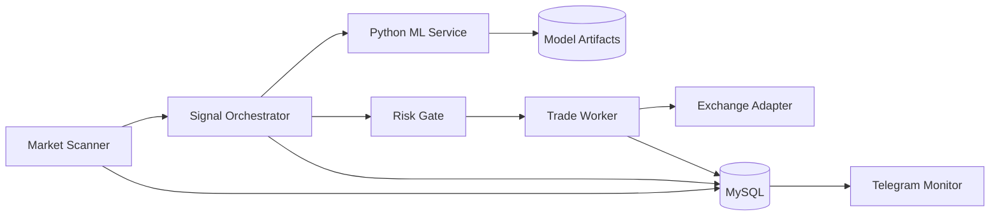

# ML Trading System Architecture

System-level architecture case study for an AI-assisted crypto trading platform. The production system combines a market scanner, signal orchestrator, ML service, risk gate, trade worker, persistence layer, and Telegram monitoring.

This repository exists to show the architecture and engineering ownership behind the system, not to publish a trading strategy.

## 30-Second Overview

The system scans crypto futures markets, builds normalized market snapshots, evaluates candidates with ML-assisted scoring, applies deterministic risk gates, and manages open positions through a separate worker.

The core engineering challenge is not "call an exchange API". It is building a system where discovery, decision-making, risk controls, and position management do not block or corrupt each other.

## My Role

I designed the system architecture, split runtime responsibilities, selected the stack, implemented key trading/ML integration parts, and documented the production risks.

My responsibilities included:

- defining scanner/orchestrator/worker boundaries;
- designing a scoring pipeline and risk gate flow;
- integrating TypeScript services with a Python ML service;
- defining database-backed audit and feedback loops;
- documenting safety controls, observability, and rollout strategy.

## System Diagram

## Components

| Component | Responsibility |
|---|---|
| Market Scanner | Discover candidate symbols and collect market context |
| Signal Orchestrator | Build snapshots and coordinate scoring/risk decisions |
| ML Service | Feature scoring and model-assisted signal evaluation |
| Risk Gate | Reject unsafe trade intents before exchange interaction |
| Trade Worker | Manage open position lifecycle, exits, and safety controls |
| Persistence | Store signals, decisions, trades, and feedback |
| Telegram Monitor | Operational visibility and alerts |

Service-level implementation showcase: [ai-crypto-trading-showcase](https://github.com/MihichN/ai-crypto-trading-showcase)

## Why This Architecture

### Why separate scanner and orchestrator?

Market discovery can run continuously and produce candidates, but candidate discovery should not directly place trades. The orchestrator is responsible for building decision context and applying downstream checks.

### Why separate worker?

Position management is safety-critical. It should continue even if new entries are paused, scanner logic fails, or ML inference is unavailable.

### Why ML service outside the trading loop?

ML inference and model training have different dependencies, runtime needs, and failure modes than exchange/order logic. Keeping ML separate makes it easier to scale, monitor, restart, and test.

### Why persist decisions?

Without persisted decisions, it is difficult to debug why a trade happened, evaluate model quality, or resume safely after restart.

## Key Engineering Problems

### Risk Controls

Problem: a high-confidence signal can still be unsafe under account, volatility, spread, or drawdown constraints.

Solution: explicit risk gate before order placement.

### Provider Latency and Failure

Problem: exchange APIs and market data providers can be slow or unavailable.

Solution: bounded timeouts, restartable workers, and persisted trade intents.

### Model Drift

Problem: market behavior changes and ML confidence can become misleading.

Solution: track model confidence, outcomes, and performance by market context.

### Duplicate Orders

Problem: retries after provider timeouts can place duplicate orders.

Solution: idempotent order intents and persisted lifecycle state.

### Operational Safety

Problem: automated trading needs a way to stop new risk while preserving exits.

Solution: kill switch for entries, independent worker for position management.

## Trade-Offs

| Decision | Benefit | Cost |
|---|---|---|
| Separate runtimes | Better fault isolation | More orchestration complexity |
| External ML service | Independent scaling and dependencies | Network/inference latency |
| Persisted trade intents | Safer recovery and auditability | More state management |
| Telegram monitoring | Fast operational visibility | Needs alert discipline |
| Testnet-first rollout | Safer releases | Slower strategy iteration |

## Production Concerns

- Hard kill switch for new entries.
- Drawdown and daily loss limits.
- Explicit provider timeouts.
- Idempotent order placement.
- Worker heartbeat monitoring.
- Model confidence drift tracking.
- Replay mode for historical market snapshots.
- Structured logs and correlation IDs.

## Approximate Scale Targets

Public-safe target assumptions:

- scanner can evaluate dozens of symbols per cycle;
- orchestrator should keep decision latency bounded;
- worker must prioritize open-position safety over new entries;
- ML inference should be separately scalable if candidate volume grows.

Exact production metrics and strategy parameters are not published.

## Public vs Private

Public repositories include:

- architecture overview;
- sanitized scoring example;
- ADRs;
- production notes;
- tests and CI.

Private production repositories include:

- exchange credentials;
- proprietary strategies;
- risk parameters;
- model weights;
- production schemas;
- deployment scripts.

## Recommended Reading Order

1. [AI Crypto Trading Showcase](https://github.com/MihichN/ai-crypto-trading-showcase) - service-level code, tests, ADRs, production notes.
2. `docs/architecture.md` inside the service showcase - sequence diagram and runtime split.
3. `docs/production.md` inside the service showcase - reliability and safety controls.

## Disclaimer

This is an engineering architecture showcase. It is not financial advice and does not publish a trading strategy.
